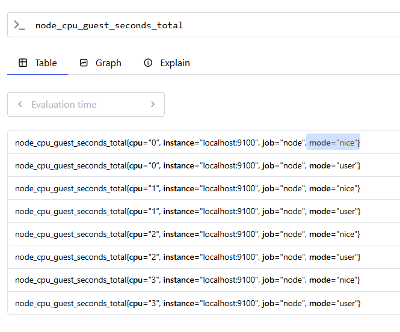
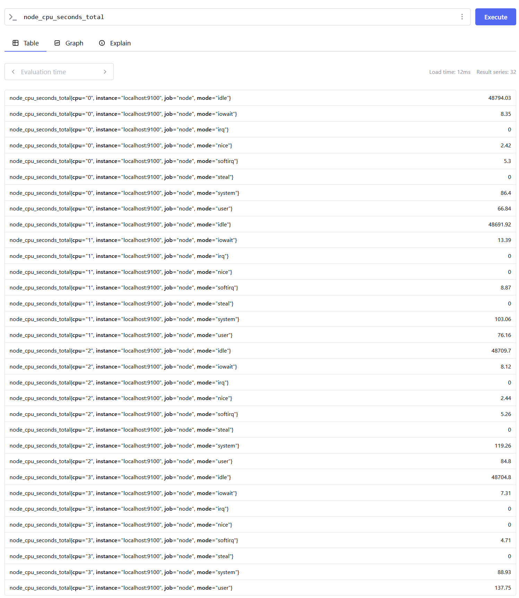

# Зберегти у файл, набір команд якими встановлювали Prometheus та Node Exporter
Встановив за допомогою docker для простоти відтворення - [docker-compose.yml](docker-compose.yml)
Перша спроба з окремими контейнерами не вдалася, оскільки prometheus не міг підключитися до node-exporter через network_mode: host. Після цього зібрав все разом через docker-compose.yml.

# Надати список метрик які показують використання CPU на вашій ОС
Дві метрики:
1. node_cpu_guest_seconds_total
1. node_cpu_seconds_total




# Надати Prometheus.yml файл
[prometheus.yml](prometheus.yml)

# Який інтервал збору метрик налаштовано?
Згідно [prometheus.yml](prometheus.yml) - 15 секунд
```
global:
  scrape_interval: 15s # Set the scrape interval to every 15 seconds. Default is every 1 minute.

```

# Скільки джерел метрик налаштовано?
Згідно [prometheus.yml](prometheus.yml) - 2: prometheus та node
```
scrape_configs:
  # The job name is added as a label `job=<job_name>` to any timeseries scraped from this config.
  - job_name: "prometheus"

    # metrics_path defaults to '/metrics'
    # scheme defaults to 'http'.

    static_configs:
      - targets: ["localhost:9090"]
       # The label name is added as a label `label_name=<label_value>` to any timeseries scraped from this config.
        labels:
          app: "prometheus"

  - job_name: "node"

    # metrics_path defaults to '/metrics'
    # scheme defaults to 'http'.

    static_configs:
      - targets: ["localhost:9100"]

```

# Screen recording
Провсяк випадок зробив запис екрана, вийшло трохи messy але весь процес.
[](https://asciinema.org/a/vJJTHCTuVlfYfr1sbxJ4S5qMk)